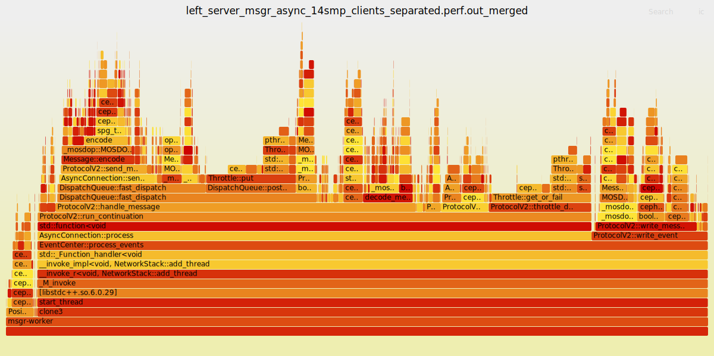

# Crimson vs. Asynchronous Messenger

In this brief report we summarise the performance results for the comparison
between the Crimson vs. the Asynchronous Messenger.

- We used the same ceph dev build from main branch (hash b1e4a2b) for both.

- We ranged over the number of clients, which matches the associated number of CPU cores.

- We used the two classes of CPU core allocation, namely Balanced and Separated NUMA. 

Our preliminary conclusions:

- The Separated CPU allocation shows a better performance than the Balanced allocation.

- The Crimson Messenger shows a better performance than the Asynchronous Messenger.

-   The results suggest the prescence of bottlenecks associated when
    increasing the number of CPU cores, which remains to be investigated
      further.

<figure id="figure:crimson_vs_async">

| _Crimson_| _Asynchronous_ |
|:---------:|:---------:|
|  |  |

<!-- This is a test to compare the performance of the Crimson Messenger
<div class="minipage">

</div>
<div class="minipage">

</div>
-->
<figcaption>Comparison Crimson vs. Async Messenger, across number of
clients (that matches the number of CPU cores on each server/client
process). The CPU allocation strategy is described in the text. Note the
maximum in linear progression for Crimson is reached at 20
clients/cores, whereas for Asynchronous the maximum is reached at 16,
before dropping. The left-hand side shows the results for the Crimson
Messenger, while the right-hand side shows the results for the
Asynchronous Messenger.</figcaption>
</figure>

Table [table:crimson-msgr](#table:crimson-msgr){reference-type="ref"
reference="table:crimson-msgr"} shows the summary results from the
Crimson Messenger clients.

<details>
<summary>Click to see the data table.</summary>
<!--  -->
<!--
{#table:crimson-msgr label="table:crimson-msgr"}-->

| _Entry_ | _IOPS balance_ | _clients connect time_ | _latency_ | _messages received_ | _messaging time_ | _out throughput_ | _smp_|
| 9 | 307.378257 | balanced | 2| 0.000601 | 6.315879 | 18479209 | 60.118791 | 1200.696318 | 2|
|10 |456.714309 |separated |2 |0.000537 |3.767112 |27495083 |60.201930 |1784.040270 |2
|13 |528.595002 |balanced |4 |0.001026 |7.466761 |31794168 |60.148446 |2064.824228 |4
|14 |860.158540 |separated |4 |0.000651 |3.763005 |51835855 |60.263141 |3359.994298 |4
|16 |1046.102510 |balanced |8 |0.001477 |7.468468 |62980255 |60.204664 |4086.337928 |8
|17 |1649.778424 |separated |8 |0.000978 |3.870238 |99482787 |60.300697 |6444.446968 |8
|0 |1954.570844 |balanced |16 |0.002781 |7.922822 |117662783 |60.198788 |7635.042360 |16
|1 |2752.619429 |separated |16 |0.001820 |5.156500 |165785459 |60.228254 |10752.419646 |16
|2 |2909.627862 |separated |18 |0.002174 |5.787955 |175092652 |60.176994 |11365.733834 |18
|3 |2229.153323 |balanced |20 |0.003867 |8.765333 |134374648 |60.280567 |8707.630169 |20
|4 |3054.879799 |separated |20 |0.002809 |6.207968 |183833595 |60.177034 |11933.124215 |20
|5 |2298.286376 |balanced |24 |0.004434 |10.319926 |138310138 |60.179686 |8977.681158 |24
|6 |2996.773003 |separated |24 |0.003162 |7.728365 |180348405 |60.180873 |11706.144545 |24
|7 |2526.839747 |balanced |28 |0.004654 |10.910158 |152236774 |60.247898 |9870.467762 |28
|8 |3175.492177 |separated |28 |0.003748 |8.430074 |191154296 |60.196743 |12404.266318 |28
|11 |2683.741510 |balanced |32 |0.005687 |11.925058 |161478779 |60.169266 |10483.365273 |32
|12 |2706.409334 |balanced |40 |0.007641 |15.021456 |162852694 |60.172969 |10571.911462 |40
|15 |2857.408738 |balanced |56 |0.013819 |19.216298 |172858700 |60.494839 |11161.752882 |56

</details>

In Figure [1.2](#figure:crimson_vs_async-rc){reference-type="ref"
reference="figure:crimson_vs_async-rc"}, we show the comparison using
latency response curves.

<figure id="figure:crimson_vs_async-rc">

| _Crimson_| _Asynchronous_ |
|:---------:|:---------:|
|  |  |

<!--
<div class="minipage">

</div>
<div class="minipage">

</div>
-->
<figcaption>Response latency curves for the comparison Crimson vs. Async
Messenger.</figcaption>
</figure>

## Background

We first describe the standalones used for the test comparison, then we
summarise the CPU core allocation Balanced vs. Separated.

### Crimson Messenger

We used the standalone `perf-crimson-msgr` for server and client, as shown in Listing
[lst:crimson](#lst:crimson){reference-type="ref" reference="lst:crimson"}.

```bash {#lst:crimson .sh language="sh" caption="Invocation of the Crimson Messenger" label="lst:crimson"}
    # Crimson messenger: seastar cpuset overrides --smp=${SMP}
    test_row["server"]="/ceph/build/bin/perf-crimson-msgr --poll-mode --mode=2 --server-fixed-cpu=0\
      --cpuset=${SERVER_CPU_CORES}"
    test_row['client']="/ceph/build/bin/perf-crimson-msgr --poll-mode --mode=1 --depth=512\
      --clients=${num_clients} --conns-per-client=2  --cpuset=${CLIENT_CPU_CORES} \
      --msgtime=60 --client-skip-core-0=0"
```

### Asynchronous Messenger

We used the standalone `perf-async-msgr` for server and `perf-crimson-msgr` for
client, as shown in Listing [lst:async](#lst:async){reference-type="ref"
reference="lst:async"}.

<!-- lst:async .sh language="sh" caption="Invocation of the Asynchronous Messenger" label="lst:async"} -->
```bash
# Async messenger: only the server is async, client is crimson
    test_row["server"]="taskset -ac ${SERVER_CPU_CORES} /ceph/build/bin/perf-async-msgr --threads=${SMP}"
    test_row['client']="/ceph/build/bin/perf-crimson-msgr --poll-mode --mode=1 --depth=512\
      --clients=${num_clients} --conns-per-client=2 --cpuset=${CLIENT_CPU_CORES} --msgtime=60\
      --client-skip-core-0=0"
```

The test is executed ranging over the number of clients, which matches
the associated number of CPU cores. We have two major cases for the CPU
core affinity of the clients and the server, respectively:

- **Balanced**: the server and client are pinned to the CPU cores using
  both a physical and its HT-sibling, on both NUMA sockets.

- **Separated**: the server and client are pinned to physical cores
  only, each on a separate NUMA socket.

This is best illustrated in the JSON configuration file shown in Listing
[lst:table-cpu](#lst:table-cpu){reference-type="ref"
reference="lst:table-cpu"}, where the number of CPU cores (and hence
clients) are listed as keys for each dictionary, their value is the
string represented the range of CPU code ids to be used as argument to
the `cpuset` option, and `taskset`, as appropriate.

```json {#lst:table-cpu .[3]Python language="[3]Python" caption="Range of clients and their CPU set" label="lst:table-cpu"}
{
"balanced": {
  "server": {
    "2": "0,56",
    "4": "0,56,28,84",
    "8": "0-1,56-57,28-29,84-85",
    "14": "0-3,56-59,28-30,84-86",
    "16": "0-3,56-59,28-31,84-87",
    "20": "0-4,56-60,28-32,84-88",
    "24": "0-5,56-61,28-33,84-89",
    "28": "0-6,56-62,28-34,84-90",
    "32": "0-7,56-63,28-35,84-91",
    "40": "0-9,56-65,28-37,84-93",
    "56": "0-13,56-69,28-41,84-97"
  },
  "client": {
    "2": "1,57",
    "4": "1,57,29,85",
    "8": "2-3,58-59,30-31,86-87",
    "14": "4-7,60-63,32-34,88-90",
    "16": "4-7,60-63,32-35,88-91",
    "20": "5-9,61-65,33-37,90-94",
    "24": "6-11,62-67,34-39,90-95",
    "28": "7-13,63-69,35-41,91-97",
    "32": "8-15,64-71,36-43,92-99",
    "40": "10-19,66-75,38-47,94-103",
    "56": "14-27,70-83,42-55,98-111"
  }
},
"separated": {
  "server": {
    "2": "0-1",
    "4": "0-3",
    "8": "0-7",
    "14": "0-13",
    "16": "0-15",
    "18": "0-17",
    "20": "0-19",
    "24": "0-23",
    "28": "0-27"
  },
  "client": {
    "2": "28-29",
    "4": "28-31",
    "8": "28-35",
    "14": "28-41",
    "16": "28-43",
    "18": "28-45",
    "20": "28-47",
    "24": "28-51",
    "28": "28-55"
  }
}
}
```

We show the extreme configurations for the Balanced CPU core allocation
for Crimson in Figures [1.3](#figure:crimson_bal_2){reference-type="ref"
reference="figure:crimson_bal_2"} and
[1.4](#figure:crimson_bal_56){reference-type="ref"
reference="figure:crimson_bal_56"}.

<figure id="figure:crimson_bal_2">

| _Crimson Server_| _Crimson Client_ |
|:---------:|:---------:|
|  |  |

<!--
<div class="minipage">

</div>
<div class="minipage">

</div>
-->
<figcaption>CPU Balanced configuration for the Crimson messenger, using
two cores for server and two cores for the client,
respectively.</figcaption>
</figure>

<figure id="figure:crimson_bal_56">

| _Crimson Server_| _Crimson Client_ |
|:---------:|:---------:|
|  |  |

<!--
<div class="minipage">

</div>
<div class="minipage">

</div>
-->
<figcaption>CPU Balanced configuration for the Crimson messenger, using
56 cores for server and 56 cores for the client,
respectively.</figcaption>
</figure>

In Figure [1.5](#figure:crimson_sep_28){reference-type="ref"
reference="figure:crimson_sep_28"}, we show theSeparated CPU allocation
where the server only uses physical CPU cores from NUMA socket 0,
whereas the client only uses physical CPU cores from NUMA socket 1. The
HT-siblings are not used in this case. The server and client are using
28 cores each, for a total of 56 cores.

<figure id="figure:crimson_sep_28">

| _Crimson Server_| _Crimson Client_ |
|:---------:|:---------:|
|  |  |

<!--
<div class="minipage">

</div>
<div class="minipage">

</div>
-->
<figcaption>Separated CPU configuration for the Crimson messenger, using
the maximum of 28 cores for server and 28 cores for the client,
respectively.</figcaption>
</figure>

In terms of CPU utilisation reported by the client, we can see
interesting differences, for example the following is a snippet of the
output of the Crimson Messenger CPU Separated running 28 clients:

    1.00516  27043 3.17101e+06  12386.7  8.41057 -- 89,95,95,94,94,95,83,95,95,94,95,96,93,94,95,95,95,94,94,96,96,95,94,95,95,95,95,96,
    1.00233  26903 3.17437e+06  12399.9  8.41014 -- 88,95,95,94,94,94,83,94,94,94,95,95,94,94,94,95,94,93,94,96,96,95,94,95,95,95,94,95,
    1.00368  26989 3.16918e+06  12379.6  8.39509 -- 89,95,95,93,94,93,83,94,94,94,94,94,94,94,94,94,94,93,94,95,96,95,94,95,95,95,94,95,
    1.00298  26925 3.17407e+06  12398.7  8.37066 -- 87,95,95,94,94,93,83,94,94,94,95,94,94,94,95,95,94,94,94,95,96,94,94,95,95,94,94,95,
    1.00247  27358 3.17295e+06  12394.3  8.40587 -- 86,95,95,94,94,93,83,93,93,94,94,94,95,95,94,95,94,94,94,95,96,94,94,95,95,94,95,96,
    1.00475  26056 3.16877e+06    12378   8.4279 -- 86,94,96,93,94,93,83,93,93,94,94,94,95,94,94,94,93,94,94,95,96,93,94,95,94,94,94,96,
    1.00432  27238 3.16835e+06  12376.4  8.37966 -- 86,94,96,93,94,93,83,93,94,94,94,95,95,94,94,95,93,94,94,95,96,93,94,95,94,94,94,96,
    1.00265  27260 3.16951e+06  12380.9  8.43864 -- 87,94,97,94,94,93,82,93,94,94,95,95,95,94,94,95,93,94,94,95,96,93,94,94,95,94,95,96,
    1.00237  27751 3.17079e+06  12385.9  8.42701 -- 87,95,96,93,93,93,82,93,93,94,95,95,94,94,94,95,93,93,93,94,95,93,94,94,95,95,95,96,
    1.00198  27185 3.16717e+06  12371.7  8.41751 -- 87,95,96,93,93,93,82,92,94,94,95,95,94,94,94,96,93,93,94,95,95,93,94,94,95,95,95,96,
    -------------- summary --------------
    40.1393     -3.17785e+06 12413.5 8.37097

In contrast notice the difference with the output of the same Crimson
Messenger running 28 clients but CPU balanced:

    1.01299  27657 2.52677e+06   9870.2  10.7857 -- 87,99,95,82,86,100,99,86,90,98,77,93,89,100,95,94,90,83,100,100,97,83,79,91,76,94,92,95,
    1.00414  27005 2.52559e+06   9865.6  10.7712 -- 88,99,96,83,86,100,99,87,89,98,76,92,89,100,95,94,90,83,100,99,97,82,79,91,76,93,92,94,
    1.00533  27777 2.53035e+06  9884.17  10.7132 -- 89,99,95,85,86,100,100,86,89,98,77,92,89,100,95,94,91,83,100,100,97,82,79,91,76,94,93,95,
    1.00242  27939 2.52323e+06  9856.38  10.8349 -- 89,99,95,84,87,100,100,87,89,98,77,92,89,100,94,95,91,84,100,100,97,83,79,91,76,94,93,95,
    1.00228  28079 2.52348e+06  9857.33  10.8177 -- 90,99,95,84,87,100,100,87,90,98,77,92,89,100,94,95,90,83,100,100,97,83,79,90,76,95,93,96,
    1.0028  28122 2.52358e+06  9857.72  10.8646 -- 90,99,95,84,87,100,100,87,90,98,77,92,89,100,94,96,90,83,100,99,97,83,79,90,75,94,93,96,
    1.0025  28067 2.52335e+06  9856.83   10.816 -- 90,99,95,83,86,100,100,87,90,98,77,93,89,100,94,95,91,83,100,99,97,83,79,90,75,94,93,96,
    1.00353  27610 2.52749e+06     9873  10.7239 -- 90,98,95,82,86,100,100,87,90,98,77,93,89,100,94,95,90,82,100,99,97,82,79,90,75,94,92,96,
    1.00457  27639 2.52251e+06  9853.55  10.8272 -- 91,98,96,83,86,100,100,86,90,98,77,93,88,100,95,95,90,82,100,99,98,82,79,90,76,94,92,95,
    1.00291  27360 2.52387e+06  9858.87  10.8139 -- 91,98,96,82,86,100,100,86,90,99,77,92,89,100,94,95,90,83,99,99,98,82,79,91,76,94,92,95,
    -------------- summary --------------
    60.2448     -2.52685e+06  9870.5 10.8015

Further investigation is in progress.

## Resource contention

As a first hypothesis, we can venture the possibility of a resource
contention when increasing the number of clients and hence CPU cores for
the server. To support this, we compare the performance between a single
instance running 28 cores vs. two instances, each running 14 cores.

(For lack of better name, we have instances named 'left' and 'right',
the summary execution results are shown below)

    == leftmsgr_crimson_14smp_14clients_balanced_client.out ==
    all(depth=14336):
      connect time: 0.002588s
      messages received: 89683481
      messaging time: 60.207390s
      latency: 9.153140ms
      IOPS: 1489575.942583
      out throughput: 5818.656026MB/s

    == leftmsgr_crimson_14smp_14clients_separated_client.out ==
    all(depth=14336):
      connect time: 0.001723s
      messages received: 120069445
      messaging time: 60.212315s
      latency: 6.414321ms
      IOPS: 1994101.163976
      out throughput: 7789.457672MB/s  <--

    == rightmsgr_crimson_14smp_14clients_balanced_client.out ==
    all(depth=14336):
      connect time: 0.002610s
      messages received: 89745195
      messaging time: 60.203232s
      latency: 9.115692ms
      IOPS: 1490704.014876
      out throughput: 5823.062558MB/s

    == rightmsgr_crimson_14smp_14clients_separated_client.out ==
    all(depth=14336):
      connect time: 0.001850s
      messages received: 120923772
      messaging time: 60.240741s
      latency: 5.980266ms
      IOPS: 2007342.022439
      out throughput: 7841.179775MB/s <--

Compare this figures against a single instance running 28 cores:

    == msgr_crimson_28smp_28clients_balanced_client.out ==
    all(depth=28672):
      connect time: 0.004654s
      messages received: 152236774
      messaging time: 60.247898s
      latency: 10.910158ms
      IOPS: 2526839.747163
      out throughput: 9870.467762MB/s

    == msgr_crimson_28smp_28clients_separated_client.out ==
    all(depth=28672):
      connect time: 0.003748s
      messages received: 191154296
      messaging time: 60.196743s
      latency: 8.430074ms
      IOPS: 3175492.177325
      out throughput: 12404.266318MB/s <  7789.457672MB/s + 7841.179775MB/s  = 15630 MB/s

This suggest that the issue is software related and such a large
difference (26%) should be visible in perf.

We need to examine the profiles (flamegraphs) for comparison of the
following CPU profiles:

- single instance (28 cores)
  `msgr_crimson_28smp_28clients_separated_client.out` versus dual
  instances of 14 cores, on both cases using the Separated NUMA
  allocation. This is expected to show the resource contention that
  occurs when the number of cores increases.

- single instance at the sweet spot (i.e., the highest performance)
  which is 16 cores, using the Separated NUMA allocation, versus the
  corresponding using the Balanced allocation. This should reveal the
  difference in performance between the two CPU allocation strategies.

# Profiling via Flamegraphs


The methodology for analysis is described as follows:

- Identification of plateaus - these show significant CPU time spent on a
function, candidate for optimisation.

- Identify the functions that are taking a considerable amount of CPU time, and
are not inlined. These are candidates for inlining.

- Identify the same or a hierarchy of functions being called from many
different places, the sum total of many calls of the same function might take
considerable fraction of CPU

- Identification of atomics, normally shown by thin towers that are called in
multiple places.

- memcpy/memmove

- functions that are taking what appears to be an unreasonably large amount of
CPU time for what the function is achieving (for example, disposing of an
object).

We use the `perf` Linux tool to collect the CPU profile, and then we use the
`flamegraph.pl` script to generate the flamegraph.

<details>
<summary>Click to see details of how we capture and process data for the flamegraphs.</summary>

- We collect the (user space CPU cycles) perf data for the server and client independently, for only 10 seconds:

```bash
fun_perf() {
  local PID=$1
  local TEST_NAME=$2
  if [ "${FLAME}" == "true" ]; then
      perf record -e cycles:u --call-graph dwarf -i -p ${PID} -o ${TEST_NAME}.perf.out sleep 10 2>&1 >/dev/null &
  fi
}
```
- We then process the perf data using the `perf script` command, and we merge
several reactors/workers into a single stack. We then apply the coalescing
transformation  (to be mentioned later in the text) using our custom made Python script:

```bash
fun_pp_flamegraphs() {
  for x in $(ls *perf.out); do
  perf script -i $x | c++filt | stackcollapse-perf.pl  |\
  sed -e 's/perf-crimson-ms/reactor/g' -e 's/reactor-[0-9]\+/reactor/g' \
   -e 's/msgr-worker-[0-9]\+/msgr-worker/g' > ${x}_merged
  python3 /root/bin/pp_crimson_flamegraphs.py -i ${x}_merged | flamegraph.pl --title "${x}" > ${x}_coalesced.svg
done
}
```
</details>

In order to compare a single server instance versus a dual server instance, we
need to process the output from the perf script into a format where all the
code paths for each individual reactor have been merged into a single stack.
Furthermore, the flamegraphs still show huge tall towers for asynchronous
computation, that is code paths involving future/promise (leading to its
eventual lambda resolution). This makes the analysis very difficult, so we need
to coalesce the multiple occurences of the same function in the code path. 

<details>
<summary>Click to see an example of a huge tall tower of asynchronous computation in the flamegraph.</summary>

The screenshot below shows the flamegraph for the single instance of the
Crimson messenger, the detail focus on the start of a huge tower involving the
asynchronous deletion of objects.


</details>

We can achieve a coalescing transformation that does not loose any information by using a
'multiset' per code path, which is essentially a set with the number of occurrences of its
elements. We replace the original code path by a corresponding multiset,
preserving the order of first occurrence of each function symbol. This is given by the fact that Python
honours the insertion order in dictionaries. We can prove that our approach
does not loose any information via mathematical induction on the lenght of the code path.

<details>
<summary>Click to see the reduction transformation of the previous tall tower.</summary>

The resulting flamegraph of applying the reduction transformation is shown
below, where the code path now contains annotations with the number of
occurrences of each function symbol. The order of occurrence is preserved.


</details>

We still need to experiment whether this coalescing transformation is useful for asynchronous computation using coroutines.


## Dual 2x14 reactor Crimson server, Separated CPU allocation

The first flamegraph shows the CPU profile comparison for the dual (two messenger servers) each running 14 reactor/cores for the NUMA Separated allocation. 

<!-- file:///Users/jjperez/Work/cephdev/Ceph_Profiling/tracker_66525/_o05/_b1e4a2b_round_02/msgr_crimson_11_fg_dual/right_server_msgr_crimson_14smp_clients_separated.perf.out_merged.svg?x=10.0&y=8245 -->
Here is the proportion of CPU time spent for the most relevant functions,

- ```do_run()```: 87.75% (main bulk of work),
<!--
but notice the right-hand side towers of ```seastar::app_template::run_deprecated```7.15%, which respectively goes to ```keep_doing()```, ```then< IOHandler::doit_in_dispatch()>```: 6%, which seems like a different code path leading to ```IOHandler::read_message()```  
-->
  - ```IOHandler::doit_in_dispatch()>```: 82.05% -- immediately above run_and_dispose(), leading to
  - ```IOHandler::read_message()```: 76.21% -- what appears to be the normal code path, which in turn is split into:
    - ```read_frame_payload()```: 15.59%, (which is a future, resolved later upwards in the same stack)
    - ``` then<crimson::net:IOHandler::read_message()```: 60.36% -- this is the continuation, which consists of:
        - ``` MessageFrame Decode```: 0.42%,
        - ``` MessageFrame destructor```: 2.04%,
        - ``` ms_dispatch()```: **41.52%**,
        - ``` decode_message()```: 9.67%

<details>
<summary>Click to see the coalesced flamegraph.</summary>


</details>

<details>
<summary>Click to see the original flamegraph (with huge towers).</summary>


</details>

Taking a closer look to the base of the tall tower leading to the ```seastar::deleter()```, we see

- ``` reactor::poll_once()```: 0.2%
- ``` seastar::object_deleter_impl```: 3.7% (from _deleter) is the huge tower
  at the right end, but do we need to multiply it by the height of the tower for
  the actual CPU utilisation? Or it just represent the chain of invocations
  (busywait) for the lambda/(future/promise) to resolve?
- similar huge tower for the code path (``` seastar::deleter::~deleter```) leading from ``` seastar::reactor::flush_tcp_batches()```, 2.01%.


## Single 1x28 reactor server, Separated CPU allocation

The following flamegraph shows the CPU profile comparison for the single server running 28 reactor/cores for the NUMA Separated allocation.

<details>
<summary>Click to see the coalesced flamegraph.</summary>


</details>

<details>
<summary>Click to see the original flamegraph.</summary>

- The tallest tower represents the object deletion: since this is an
  asynchronous operation, it is expected to be the more expensive on a Balanced
  CPU allocation since it involves evicting from the CPU cache memory lines being
  used by the other reactor running in the physical core id. The height of the
  tower is proportional to the number of lambda resolutions required to complete
  the asynchronous operation.


</details>

Looking at the same code paths as above, to have a rough estimation:

- ```do_run()```: 93.03% (+5% from dual server above)

    - ```IOHandler::doit_in_dispatch()>```: 89.64% (+7%)

    - ```IOHandler::read_message()```: 74.17% (+2%)

        - ```read_frame_payload()```: 7.12% (+8.47%)
        - ```then<crimson::net:IOHandler::read_message()```: 74.19% (-13.83%)

            - ```MessageFrame Decode```: 0.30% (-0.12%)
            - ```MessageFrame destructor```: 1.44% (-1.60%)
            - ```ms_dispatch()```: 46.96% (+5.44%)
            - ```decode_message()```: 9.67% (same).
            
<!--
The above comparisoon suggest to look at the code path leading to
```ms_dispatch()```, which is the main function for dispatching the 
messages to the corresponding handler.
-->

The above comparisoon suggest to look at the memory profile to get further details on the 
```ms_dispatch()```, which is the main function for dispatching the 
messages to the corresponding handler.

## Dual 2x14 SMP Asynchronous server, Separated CPU allocation

The following flamegraph shows the CPU profile comparison for the dual (two asynchronous messenger servers) each running 14 client/cores for the NUMA Separated allocation.

- ```msgr-worker()```: 100%, split on three main code paths:
    - ```PosixConnectedSocketImpl::send()```: 3.89%,
    - ```EventCenter::process_events()```: 95.48%, split into two main segments
        - ```AsyncConnection::process()```: 78.90%, this unfolds up to ```ProtocolV2::run_continuation()``` 78.87%, which is the main code path for the async messenger.
            - ```ProtocolV2::handle_message()```: 51.33%.
        - ```ProtocolV2::write_event()```: 16.54%



## Single 1x28 SMP Asynchronous server, Separated CPU allocation

Similarly, we look at the main codepaths for the single server running 28 reactor/cores for the NUMA Separated allocation.

- ```msgr-worker()```: 100%, split on three main code paths:
    - ```PosixConnectedSocketImpl::send()```: 4.433%,
    - ```EventCenter::process_events()```: 94.90% (-0.58%), split into two main segments
        - ```AsyncConnection::process()```: 72.23% (+6.77%), this unfolds up to ```ProtocolV2::run_continuation()``` 72.21% (-6.66%), which is the main code path for the async messenger.
            - ```ProtocolV2::handle_message()```: 51.62 (+0.29%).
        - ```ProtocolV2::write_event()```: 22.63% (+6.09%)


## Comparison dual server instance vs. single server instance
<!--, Separated CPU allocation -->

We use differential [flamegraphs](https://www.brendangregg.com/blog/2014-11-09/differential-flame-graphs.html) for this section.

<details>
<summary>Click to see details on the construction of the differential flamegraphs.</summary>

We construct the differential flamegraphs as follows: on the left is the single server instance, on
the right the dual server instance.

```bash
tmp/_b1e4a2b/msgr_crimson_11
# Single Crimson instance server 1x28 SMP NUMA separated vs. dual 2x14 SMP Crimson server also NUMA separated:
difffolded.pl  _server_msgr_crimson_28smp_clients_separated.coalesced ../_03_async_crimson_lr_fg/left_server_msgr_crimson_14smp_clients_separated.coalesced | flamegraph.pl --title "server_msgr_crimson_28smp_vs_14smp" > server_msgr_crimson_28smp_vs_14smp_coalesced.svg

# Single Crimson instance server 1x28 SMP Balanced vs. dual server 2x14 SMP Crimson also Balanced:
difffolded.pl _server_msgr_crimson_28smp_clients_balanced.coalesced ../_03_async_crimson_lr_fg/left_server_msgr_crimson_14smp_clients_balanced.coalesced | flamegraph.pl --title "server_msgr_crimson_28smp_vs_14smp_Balanced" > server_msgr_crimson_28smp_vs_14smp_bal_coalesced.svg

# Single Crimson instance server 1x28 SMP Balanced vs. dual 2x14 SMP Crimson server NUMA Separated:
difffolded.pl _server_msgr_crimson_28smp_clients_balanced.coalesced  ../_03_async_crimson_lr_fg/left_server_msgr_crimson_14smp_clients_separated.coalesced | flamegraph.pl --title "server_msgr_crimson_28bal_vs_14sep_bal" > server_msgr_crimson_28bal_vs_14sep_coalesced.svg

# Single asynchronous instance 1x28 SMP server NUMA separated vs. dual server asynchronous 2x14 SMP NUMA Separated:
difffolded.pl  _server_msgr_async_28smp_clients_separated.perf.out_merged _03_async_crimson_lr_fg/left_server_msgr_async_14smp_clients_separated.perf.out_merged | flamegraph.pl  --title "server_msgr_async_28sep_vs_14sep" > server_msgr_async_28smp_vs_left_14smp_sep_merged.svg

# Single asynchronous instance 1x28 SMP server NUMA separated vs. dual server asynchronous 2x14 SMP CPU Balanced:
difffolded.pl  _server_msgr_async_28smp_clients_balanced.perf.out_merged _03_async_crimson_lr_fg/left_server_msgr_async_14smp_clients_balanced.perf.out_merged | flamegraph.pl --title "server_msgr_async_28sep_vs_14bal" > server_msgr_async_28sep_vs_14bal_merged.svg
```

</details>

The following differential flamegraph shows a single instance running 28 reactors Crimson Messenger server, vs. two instances of the Crimson messenger server each running 14 reactors. 

*Notes:*

- to make the comparison possible, all the reactors have been merged into a
  single stack.

- The CPU allocation strategy is NUMA Separated, using physical
  cores only.

- The client for the former is also using 28 cores, but on the other NUMA
  socket. The clients for the latter are using 14 cores each, on the other NUMA
  socket. 

- The flamegraph shows the difference in blue to indicate when the
  performance is worse for the single instance (28 cores) vs. the
  dual instance (14 cores each). The opposite is shown in red.

<details>
<summary>Click to see the flamegraph (server_msgr_crimson_28smp_vs_14smp_sep).</summary>


</details>

The second flamegraph shows the corresponding CPU profile comparison for the Asynchronous messenger.


<!-- 
More profiles would be added to this section, including the original ones showing the multiple reactor/workers, as appropriate.
-->

The third flamegraph shows the comparison for the single server running 28 reactor/cores vs. dual instance server running 14 reactors, both using the NUMA Balanced allocation.

<details>
<summary>Click to see the flamegraph (server_msgr_crimson_28smp_vs_14smp_bal).</summary>


</details>

Finally, we show a comparison involving Balanced vs. Separated CPU allocation.


<details>
<summary>Click to see the flamegraph (server_msgr_crimson_28bal_vs_14sep).</summary>


</details>


We will continue with the analysis of the flamegraphs, and we will add more as
required for comparing Separated vs. Balanced CPU allocation, as appropriate.
